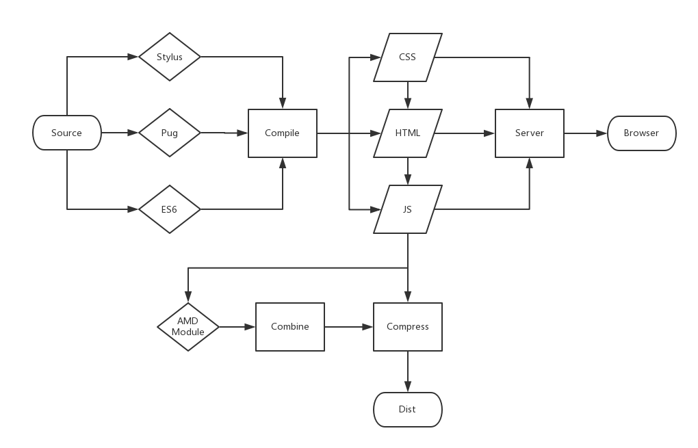

# The tool for web development

> pug + stylus + es6

[](https://www.npmjs.com/package/boruto)
[](https://github.com/cntanglijun/boruto)
[](https://github.com/cntanglijun/boruto/tags)
[](https://github.com/cntanglijun/boruto/releases)
[](https://www.npmjs.com/package/boruto)
[](https://raw.githubusercontent.com/cntanglijun/boruto-cli/master/LICENSE)

## Workflow



## Installation

``` bash
npm i boruto -g
```

## Usage

##### Initialization

``` bash
boruto init [directory]
```

| param | desc |
|:---:|:---:|
| [directory] | Set the dir for initialization |


##### Debug

```bash
boruto server [directory]
```

| param | desc |
|:---:|:---:|
| [directory]| Set the dir for server |

##### Dist

```bash
boruto dist [directory]
```

| 参数 | 说明 |
|:---:|:---:|
| [directory] | Set the dir for dist |

## .borutorc

The config file for boruto

```json
{
  "server": {
    "extDirs": [],
    "serveStatic": [],
    "port": 8080,
    "open": false
  },
  "dist": {
    "distDir": "dist",
    "compress": true,
    "requirejsConfig": "app/scripts/config.js",
    "amdOptimizationDir": [
      "app/scripts"
    ],
    "templateDir": [
      "app/scripts/_template"
    ],
    "moduleDir": []
  }
}
```

Boruto's server use browsersync, so you can find more options in [https://browsersync.io/docs/options/](https://browsersync.io/docs/options/)

## License

MIT
